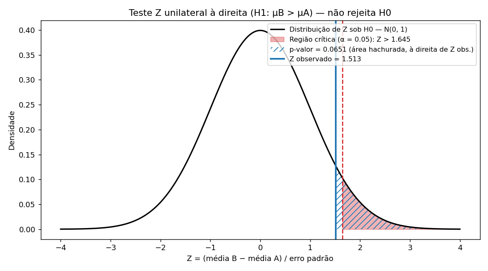

# 🎓 Teste A/B — Efetividade de Duas Estratégias de Ensino

Exercício do **Módulo 19 (Estatística Aplicada)** do curso **EBAC — Profissão: Cientista de Dados**. Uma escola compara duas estratégias de ensino de matemática (50 alunos em cada) e quer saber se a estratégia **B** gera notas médias maiores que a **A**, usando um **teste Z** para duas médias com desvios padrão populacionais conhecidos.

- **H0:** μB = μA  ·  **H1:** μB > μA (teste **unilateral à direita**)
- **Estatística:** Z = (x̄B − x̄A) / √(σA²/nA + σB²/nB), com σA = 10 e σB = 12  ·  **α = 0,05**

## 📊 Resultados

| Grandeza | Valor |
|---|---|
| Média amostral A / B | 71,41 / 74,75 (diferença B − A = **+3,34**) |
| Variância amostral A / B | 129,3 / 110,5 (populacionais: 100 / 144) |
| Erro padrão da diferença | 2,209 |
| **Z observado** | **1,513** (Z crítico à direita: 1,645) |
| **p-valor** | **0,0651** |
| **Decisão (α = 0,05)** | **Não rejeita H0** |
| IC 95% da diferença | [−0,99; 7,67] |
| Poder do teste (diferença real de 5 pontos, n = 50) | ≈ 73% |
| n por grupo para 80% de poder | 61 |

**Conclusão:** não há evidência estatística suficiente, a 5%, de que B seja melhor que A. O resultado é fronteiriço (p = 0,065) e o teste tem poder limitado: os dados foram simulados com diferença real de 5 pontos, e com 50 alunos por grupo o teste a detecta em ~73% das amostras. Recomenda-se repetir o experimento com ≥ 61 alunos por grupo antes de descartar a estratégia B.



## 📁 Estrutura

```
Teste_AB_Estrategias_Ensino/
├── data/raw/notas_estrategias.csv     # 100 notas simuladas (seed 0), formato longo
├── notebooks/01_teste_z_estrategias_ensino.ipynb   # exercício completo, com saídas
├── src/
│   ├── config.py        # parâmetros do enunciado, α, direção do teste
│   ├── data.py          # geração reprodutível e leitura dos dados
│   ├── stats_tests.py   # teste Z (3 caudas), IC, d de Cohen, poder, tamanho de amostra
│   ├── plots.py         # gráfico da distribuição de Z e curva de poder
│   └── pipeline.py      # pipeline completo (CLI)
├── tests/               # pytest (12 testes, inclui simulação de Monte Carlo)
├── reports/             # results.json + figures/
├── requirements.txt
└── README.md
```

## ▶️ Como executar

```bash
python -m venv .venv && source .venv/bin/activate      # Windows: .venv\Scripts\activate
pip install -r requirements.txt

jupyter notebook notebooks/      # abre de notebooks/ ou da raiz
python -m src.pipeline           # pipeline em linha de comando (~1 s)
pytest                           # testes
```

## 🛠️ Stack
`Python` · `NumPy` · `pandas` · `SciPy` · `matplotlib` · `pytest`

---
**Autor:** Talita Luci · [github.com/TalitaLuci](https://github.com/TalitaLuci)
